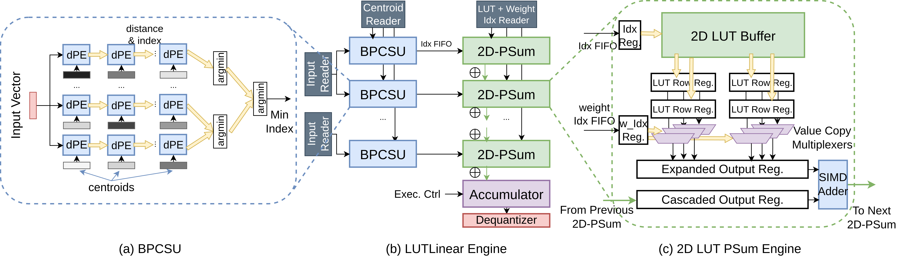
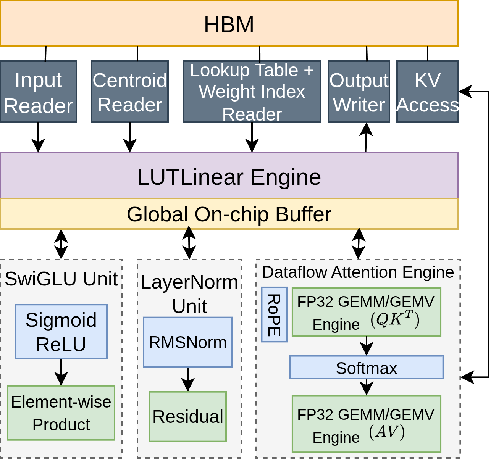
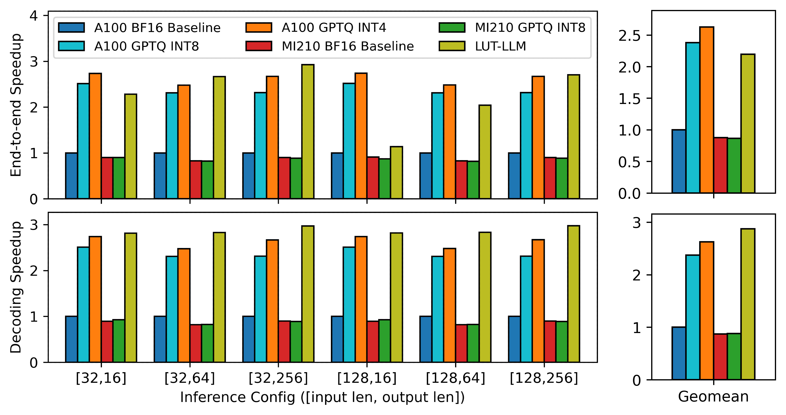

# LUT-LLM: Efficient Language Model Inference with Memory-based Computations on FPGAs

<p align="center">
  
</p>

<p align="center">
  
  
</p>

**LUT-LLM** is the first FPGA accelerator that deploy 1B+ language model with memory-based computation, leveraging vector quantization. LUT-LLM features:

- **Activation-weight Co-quantization**: shrinked lookup tables with comparable accuracy compared with standard scalar quantization schemes.
- **Bandwidth-aware Parallel Centroid Search**: tradeoffs between resource consumption for parallel search and latency of pipeline propagation during decoding.
- **Efficient 2D table lookup**: extract rows and then copy to reduce fanout with low on-chip capacity required per operation at runtime.
- **Temporal-Spatial Hybrid Execution**: LUT-LLM sequentially execute between LUTLinear and other engines, and keep dataflow inside each engine.

---

## Artifact Evaluation

Make sure your system has Vitis/Vivado 2024.2 and Gurobi installed. You may need to run `settings.sh` for Vitis and Vivado to set up the path.

0. Install [TAPA](https://drive.google.com/file/d/1-GJDFHiaIDOldNGgtdgDSRxlDvRoBzSt/view?usp=drive_link): Download and untar this folder into your home and add the `PATH` variable in your `~/.bashrc`
```bash
tar -xf tapa.tar
export PATH="$PATH:~/.rapidstream-tapa/usr/bin"
```

1. Generate host executable for prefill and decode.
```bash
cd qwen_block
make csim
make csim_decode
```

2. Run C-simulation
```bash
./qwen_block
./qwen_block_decode
```

3. Run HLS
```bash
make hls
```

4. Run RTL Simulation
```bash
./qwen_block --bitstream=qwen_block.xo -xosim_save_waveform -xosim_work_dir=waveform/
./qwen_block_decode --bitstream=qwen_block.xo -xosim_save_waveform -xosim_work_dir=waveform/
```
> [!NOTE]
> If you are using the VASTLab cluster as the guest account, we can provide the wdb directly to save the time of running RTL simulation.

5. Open the waveform in `waveform/output/run/vivado/tapa-fast-cosim.sim/` with Vivado and get the cycle count for each.

6. Run the e2e latency calculator to validate. Use the cycle count from the previous step as the argument for the script.
```bash
make e2e_latency
./e2e_latency <prefill_cycle> <decode_cycle>
```

## Project Structure

Detail will come later.